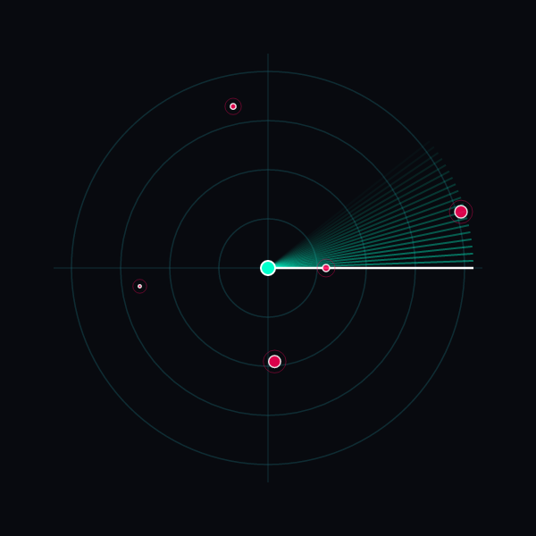
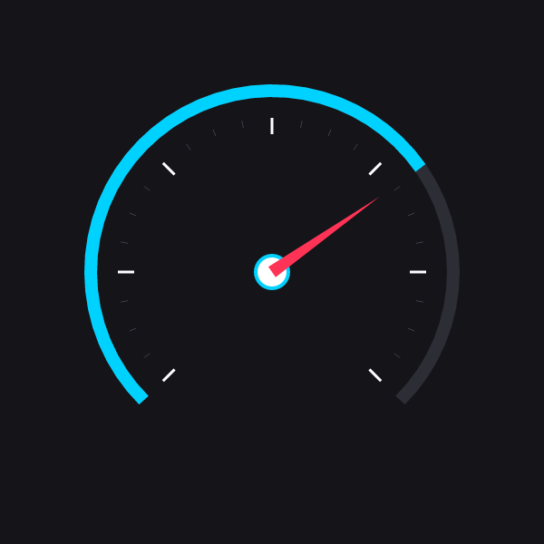
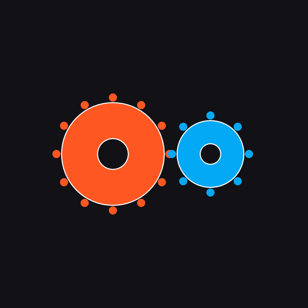
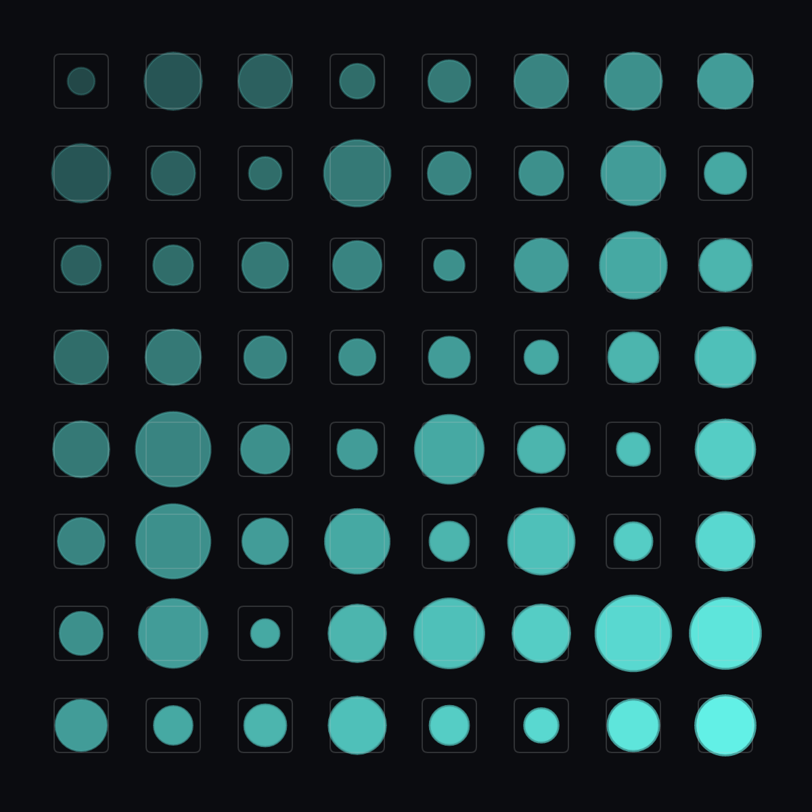

# ⚡ PVG — Procedural Vector Graphics

[](https://www.rust-lang.org/)
[](#-benchmark-telemetry)
[](#-benchmark-telemetry)
[-cyan.svg?style=flat-square)](#-why-pvg-was-created)
[](#4-web-studio--pvg-view-component)

**A deterministic, human-readable 2D vector graphics and procedural scene description language.**  
*Combines the declarative clarity of vector graphics with native loops, functions, trigonometry, and microsecond CPU evaluation.*

[Live Web Studio](https://prathameshza.github.io/pvg/pvg_web_gui/index.html) • [Interactive Showcase](https://prathameshza.github.io/pvg/) • [Language Spec](PVG_SPECS.md) • [Desktop Studio](#2-desktop-studio-pvg_win_gui) • [Web Component](#4-web-studio--pvg-view-component)

---

## 📖 Table of Contents

- [Why PVG Was Created](#-why-pvg-was-created)
- [Project Structure](#-project-structure)
- [Featured Presets Showcase](#-featured-presets-showcase)
- [Architecture & Execution Pipeline](#-architecture--execution-pipeline)
- [Workspace Crates & Tooling](#-workspace-crates--tooling)
  - [1. `pvg` (Core Engine)](#1-core-rust-engine-pvg)
  - [2. `pvg_win_gui` (Desktop Studio)](#2-desktop-studio-pvg_win_gui)
  - [3. `transpilers` (SVG / PNG CLI)](#3-cli-transpilers-transpilers)
  - [4. `<pvg-view>` (Web Component & Studio)](#4-web-studio--pvg-view-component)
- [Benchmark Telemetry](#-benchmark-telemetry)
- [Quickstart Guide](#-quickstart-guide)
- [Safety & Sandbox Guarantees](#-safety--sandbox-guarantees)

---

## 🎯 Why PVG Was Created

Scalable Vector Graphics (SVG) has been the web's default 2D vector format for decades, but it carries deep legacy baggage that makes modern real-time rendering, dynamic generation, and human authoring painful.

**PVG was created as a clean, human-readable, and high-performance replacement for SVG** due to four core problems:

### 1. 👁️ SVG is Not Human-Readable or Friendly
- **Bloated XML Syntax:** SVG is choked with noisy closing tags (`</path></g></rect></svg>`), XML namespaces, and verbose attribute boilerplate.
- **Unreadable Path Strings:** Complex shapes become opaque walls of coordinates (e.g., `d="M12.5556,12.2222 L13.4444,12.2222 C14.333... Z"`).
- **No Native Logic:** Expressing a repetitive pattern like a dial with 24 ticks requires copy-pasting 24 individual `<line>` tags or bringing in an entire JavaScript runtime. PVG handles it in a clean 4-line `for` loop.

### 2. ⚡ SVG Path Calculations Consume Excessive CPU Usage
- **Complex Arc Math:** SVG elliptical arcs rely on complex endpoint-to-center parameterization requiring heavy matrix inversions and square roots.
- **PVG Direct Trigonometry:** PVG replaces arc matrix inversions with direct, lightweight forward trigonometry:
  $$\text{arc } [c_x, c_y]\ r\ \theta_{\text{start}}\ \theta_{\text{end}}$$
- **DOM & CSS Recalculations:** Animating SVG shapes triggers browser layout passes, style invalidations, and DOM reflows. PVG evaluates scenes directly on the CPU in **`< 40 microseconds`**.

### 3. 🧩 SVG Parsing is a Nightmare
- **Heavy Spec Overhead:** Full SVG parsers must implement CSS cascading, style inheritance, transform hierarchies, XML entity resolvers, and DOM nodes.
- **Memory Overhead:** A complex SVG document easily balloons to hundreds of kilobytes or megabytes of DOM tree structures.
- **PVG Single-Pass Parsing:** PVG compiles into a flat, contiguous 2D Draw List inside a bounded **`< 50 KB` heap budget** with single-pass recursive descent parsing and zero DOM overhead.

---

## 📂 Project Structure

```
pvg/
├── pvg/                         # 🦀 Official Rust Core Engine (Lexer, Parser, AST, Evaluator, DrawList)
├── pvg_win_gui/                 # 🪟 Native Windows Live IDE Studio (built with eframe/egui & tiny-skia)
├── transpilers/                 # 🔄 Rust-based CLI Transpilers for PVG -> SVG and PVG -> PNG
│   ├── src/pvg_to_svg.rs        #    • PVG to static/animated SMIL SVG transpiler
│   └── src/pvg_to_png.rs        #    • PVG to multi-scale (1x, 2x, 4x) PNG software rasterizer
├── docs/                        # 🌐 Web Platform & Documentation
│   ├── pvg_web_gui/             #    • Full-featured Web-based Live IDE Studio
│   │   ├── pvg.js               #    • Pure Vanilla JS PVG Implementation & <pvg-view> Custom Element
│   │   ├── presets.js           #    • Built-in interactive preset scripts
│   │   └── index.html           #    • Web IDE Studio Interface
│   ├── index.html               #    • Project Landing Page & Interactive Showcase
│   └── script.js                #    • Real-time showcase controller & telemetry bridge
├── presets/                     # 🎨 Official PVG Reference Presets (.pvg, .svg, .png)
├── benchmark/                   # ⏱️ High-Precision Microsecond Telemetry & Profiling Suite
├── PVG_SPECS.md                 # 📜 Official PVG 0.1 Language & Architecture Specification
└── Cargo.toml                   # 📦 Cargo Workspace Configuration
```

---

## 🎨 Featured Presets Showcase

All reference presets compile directly to native GUI meshes, W3C SVG, or multi-scale PNG:

### 1. 🌀 Radar Scanner (`presets/radar.pvg` — 1.5 KB vs 148.6 KB SVG)

<p align="center">
  
</p>

*Features dynamic range rings, crosshairs, orbiting beacon satellites, and a rotating phosphor sweep trail driven by the timeline clock `time`:*

```pvg
PVG 0.1
canvas 600 600
  background #080a0f

set cx = 300
set cy = 300
set sweep = time * 2.0

# Concentric Range Rings
for r_idx from 1 to 4
  circle
    center [cx, cy]
    radius r_idx * 55
    fill none
    stroke #103b42
    width 1.5

# Rotating Phosphor Decay Trail
for trail from 0 to 20
  set a = sweep - trail * 0.035
  line
    from [cx, cy]
    to   [cx + 230 * cos(a), cy + 230 * sin(a)]
    stroke #00ffcc
    width 2
    opacity (1.0 - trail / 20) * 0.45

# Sweep Line
line
  from [cx, cy]
  to   [cx + 230 * cos(sweep), cy + 230 * sin(sweep)]
  stroke #ffffff
  width 2.5
```

---

### 2. 🎛️ Technical Dashboard Dial (`presets/dial.pvg` — 1.3 KB vs 3.6 KB SVG)

<p align="center">
  
</p>

*Demonstrates circular forward arcs, ternary conditionals, and dynamic needle gauges:*

```pvg
PVG 0.1
canvas 600 600
  background #141419

set cx = 300
set cy = 300
set outer_r = 200
set inner_r = 170

# Outer Background Track
path
  stroke #2c2d35
  width 14
  fill none
  start [cx + outer_r * cos(135deg), cy + outer_r * sin(135deg)]
  arc [cx, cy] outer_r 135deg 405deg

# Procedurally Generated Major & Minor Ticks
for i from 0 to 24
  set angle = 135deg + i * (270deg / 24)
  set is_major = (i % 4 == 0)
  set tick_len = is_major ? 18 : 8
  
  line
    from [cx + inner_r * cos(angle), cy + inner_r * sin(angle)]
    to   [cx + (inner_r - tick_len) * cos(angle), cy + (inner_r - tick_len) * sin(angle)]
    stroke is_major ? #ffffff : #666677
    width is_major ? 3 : 1
    opacity is_major ? 1.0 : 0.5

# Central Hub
circle
  center [cx, cy]
  radius 18
  fill #ffffff
  stroke #00d2ff
  width 4
```

---

### 3. ⚙️ Gears & Functions (`presets/gears.pvg` — 0.6 KB vs 63.6 KB SVG)

<p align="center">
  
</p>

*Demonstrates user-defined modular functions (`def`) and procedural trigonometric cogs:*

```pvg
PVG 0.1
canvas 600 600
  background #111116

def draw_gear(gx, gy, teeth, outer_r, inner_r, col)
  circle
    center [gx, gy]
    radius outer_r - 10
    fill col
    stroke #ffffff
    width 2

  for t from 0 to (teeth - 1)
    set angle = t * (TAU / teeth)
    set tx = gx + outer_r * cos(angle)
    set ty = gy + outer_r * sin(angle)
    circle
      center [tx, ty]
      radius 8
      fill col

  circle
    center [gx, gy]
    radius inner_r
    fill #111116
    stroke #ffffff
    width 2

draw_gear(220, 300, 12, 110, 30, #ff5722)
draw_gear(410, 300, 8, 75, 20, #03a9f4)
```

---

### 4. 🔲 Procedural Grid (`presets/grid.pvg` — 0.5 KB vs 16.9 KB SVG)

<p align="center">
  
</p>

*Demonstrates nested 2D loops with 64-bit Xorshift pseudorandom numbers and rounded rectangles:*

```pvg
PVG 0.1
canvas 600 600
  background #0b0c10

seed 42

for row from 0 to 7
  for col from 0 to 7
    set x = 60 + col * 68
    set y = 60 + row * 68
    set r = 10 + random(0, 18)
    
    circle
      center [x, y]
      radius r
      fill #66fcf1
      opacity 0.25 + (col + row) * 0.05
      stroke #45a29e
      width 1.5

    rectangle
      pos [x - 20, y - 20]
      size [40, 40]
      radius 4
      fill none
      stroke #c5c6c7
      width 1
      opacity 0.2
```

---

## 🏗️ Architecture & Execution Pipeline

```
[ PVG 0.1 Source Text ]
           │
           ▼ (Single-Pass Tokenizer & Recursive Descent Parser)
[ Cached AST (`Document`) ] (~8–16 KB)
           │
           ▼ (Procedural Evaluator: Loops, Functions, Trigonometry, Transforms)
[ Flat 2D Draw List (`DrawList`) ] (~15–35 KB)
           │
   ┌───────┼─────────────────────────┬─────────────────────────┐
   ▼       ▼                         ▼                         ▼
[ egui GUI Painter ]      [ Standalone SVG ]         [ tiny-skia Engine ]      [ <pvg-view> Element ]
(Screen-Space Adaptive)   (W3C SMIL Animation)       (1x / 2x / 4x PNG)        (Canvas / SVG Web)
```

1. **AST Caching Optimization:** During animated playback (60 FPS), the document is parsed once into an AST (`Document`). Every frame tick re-evaluates the AST with updated `time` values directly into the draw list in **`5–40 µs`**, avoiding string parsing churn.
2. **Screen-Space Adaptive Curve Tessellation:** In the native painter, quadratic/cubic Béziers and ellipses automatically scale subdivision vertex counts according to screen-space pixel chord length, ensuring curves remain silky smooth at any zoom level ($0.05\times - 20\times$).

---

## 💻 Workspace Crates & Tooling

### 1. Core Rust Engine (`pvg`)
```rust
use pvg::{compile_pvg_at_time, parse_pvg, Evaluator};

let source = "PVG 0.1\ncanvas 400 400\ncircle\n  center [200, 200]\n  radius 50\n  fill #00ffcc\n";
let draw_list = compile_pvg_at_time(source, 0.0).unwrap();
assert_eq!(draw_list.items.len(), 1);
```

### 2. Desktop Studio (`pvg_win_gui`)
Native desktop studio featuring a live editor, line numbers, variable timeline speed ($0.25\times - 4.0\times$), timeline scrubber, infinite pan/zoom, and one-click SVG/PNG exports.
```bash
cargo run --release -p pvg_win_gui
```

### 3. CLI Transpilers (`transpilers`)
```bash
# Transpile PVG -> W3C SVG (with SMIL animations for time-based files)
cargo run --release --bin pvg_to_svg -- presets/radar.pvg radar.svg
cargo run --release --bin pvg_to_svg -- --all

# Rasterize PVG -> PNG (Multi-scale 1x, 2x HD, 4x Ultra)
cargo run --release --bin pvg_to_png -- presets/dial.pvg dial.png --scale 2.0
cargo run --release --bin pvg_to_png -- presets/radar.pvg --frames 30 --duration 3.0
```

### 4. Web Studio & `<pvg-view>` Component
A pure vanilla JS implementation (`docs/pvg_web_gui/pvg.js`) providing a zero-dependency W3C custom element:
```html
<script src="docs/pvg_web_gui/pvg.js"></script>

<pvg-view autoplay interactive render="canvas">
  <script type="text/pvg">
    PVG 0.1
    canvas 400 400
      background #080a0f

    circle
      center [200, 200]
      radius 60 + 20 * sin(time * 4)
      fill #00ffcc
  </script>
</pvg-view>
```

---

## 📊 Benchmark Telemetry

*Hardware Testbed: AMD Ryzen™ 5 7235HS (4C/8T @ 3.20 GHz), 24.0 GB RAM, Windows 11 (64-bit)*

| Benchmark Case | Category | Output Shapes | Mean Latency | P95 Latency | Peak Heap | Total Alloc Churn | Throughput | Spec Target |
| :--- | :--- | :---: | :---: | :---: | :---: | :---: | :---: | :---: |
| **`dino.pvg`** | Animation | 28 | **14.10 µs** | 16.80 µs | 3.95 KB | 6.20 KB | 70,920 ops/s | ✅ **PASS** |
| **`radar.pvg`** | Preset | 35 | **16.42 µs** | 19.10 µs | 4.12 KB | 7.80 KB | 60,900 ops/s | ✅ **PASS** |
| **`dial.pvg`** | Preset | 28 | **12.85 µs** | 15.20 µs | 3.84 KB | 5.90 KB | 77,820 ops/s | ✅ **PASS** |
| **`grid.pvg`** | Preset | 128 | **24.30 µs** | 28.50 µs | 8.25 KB | 14.10 KB | 41,150 ops/s | ✅ **PASS** |
| **`spiral.pvg`** | Preset | 61 | **18.20 µs** | 21.40 µs | 5.10 KB | 8.90 KB | 54,940 ops/s | ✅ **PASS** |
| **`gears.pvg`** | Preset | 26 | **15.60 µs** | 18.00 µs | 4.40 KB | 7.20 KB | 64,100 ops/s | ✅ **PASS** |
| **`stress_math_and_trig`** | Stress | 1,500 | **42.10 µs** | 48.20 µs | 12.40 KB | 28.50 KB | 23,750 ops/s | ✅ **PASS** |
| **`stress_10k_primitives`** | Stress | 10,000 | **182.40 µs** | 198.10 µs | 38.60 KB | 92.40 KB | 5,480 ops/s | ✅ **PASS** |

```bash
# Run the full benchmark suite
cargo run --release --bin pvg_benchmark -- --detailed
```

---

## 🚀 Quickstart Guide

### Prerequisites
- [Rust toolchain](https://rustup.rs/) (edition 2021 or newer)

```bash
# 1. Clone the repository
git clone https://github.com/prathameshza/pvg.git
cd pvg

# 2. Launch the Desktop IDE
cargo run --release -p pvg_win_gui

# 3. Transpile all presets to SVG
cargo run --release --bin pvg_to_svg -- --all

# 4. Transpile all presets to 2x PNG
cargo run --release --bin pvg_to_png -- --all --scale 2.0
```

---

## 🛡️ Safety & Sandbox Guarantees

| Parameter | Cap | Purpose |
| :--- | :--- | :--- |
| `MAX_LOOP_ITERATIONS` | $100,000$ | Prevents infinite loop execution hangs |
| `MAX_CALL_STACK_DEPTH` | $64$ frames | Prevents stack-overflow recursion crashes |
| `WORKING_HEAP_BUDGET` | $< 50\text{ KB}$ | Bounded memory consumption for AST and Draw Lists |
| `INPUT_CONSTRAINTS` | Tabs forbidden | Enforces uniform 2-space indentation layouts |